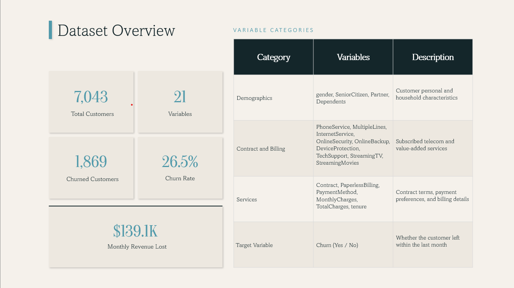
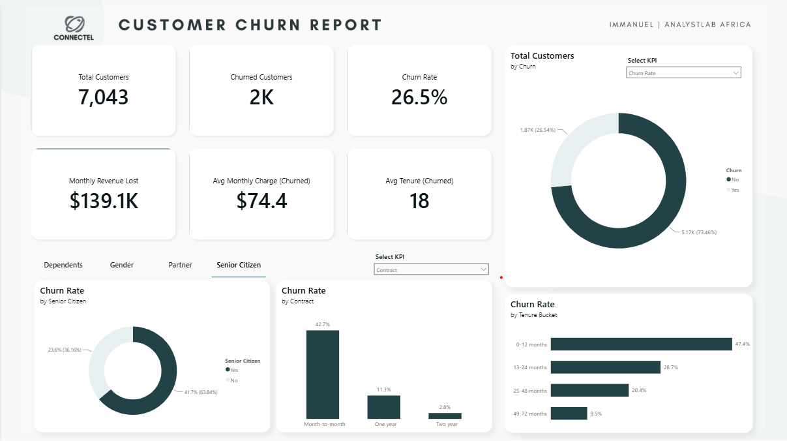
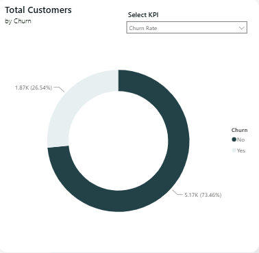
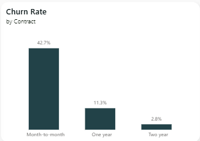
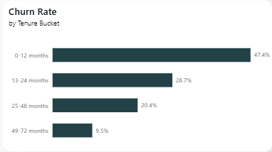
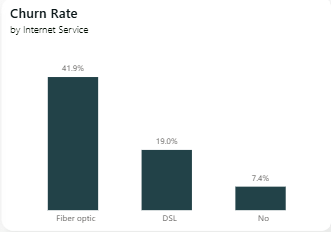

# Project Background
ABC Communications is a telecommunications company that provides customers with internet, phone, and related communication services through a variety of subscription plans and contract options.

As competition within the telecommunications industry continues to increase, customer retention has become a critical business priority. The company has accumulated substantial customer data covering demographics, subscription details, service usage, billing information, and customer account history. However, this data has not been fully leveraged to understand the factors driving customer churn.

This project analyzes the company's customer data to identify the key drivers of churn, uncover customer behavior patterns, and provide actionable recommendations that support customer retention and business growth.

Insights and recommendations are provided on the following key areas:

- **Customer Churn Analysis:** Identification of the demographic, service-related, and financial factors associated with customer churn.
- **Customer Segmentation:** Analysis of customer groups based on contract type, internet service, payment method, tenure, and other key characteristics to identify high-risk segments.
- **Service and Payment Analysis:** Evaluation of how internet service types, contract plans, and payment methods influence customer retention.
- **Business Risks and Opportunities:** Identification of customer retention risks and opportunities to improve loyalty, reduce churn, and enhance long-term profitability.

A interactive PowerBI dashboard can be downloaded [here.](https://github.com/Immanuel-19/Telco-Churn-Analysis-Week-1-Analystlab-Africa/raw/refs/heads/main/dashboard/Customer%20Churn%20Report.pbix)

The Python Jupyter Notebook used for preprocessing and analysis can be found [here.](https://github.com/Immanuel-19/Telco-Churn-Analysis-Week-1-Analystlab-Africa/blob/main/notebook/telco_churn_analysis.ipynb)

# Data Structure & Initial Checks

The customer churn dataset consists of 7,043 customer records and 21 variables, with each record representing a unique customer. The variables are grouped into four main categories: Demographics, Services, Contract & Billing, and the Target Variable (`Churn`). 

Prior to beginning the analysis, initial data inspection identified missing values in the `TotalCharges` column, which were handled during the data cleaning process to ensure the dataset was suitable for analysis.

# Executive Summary

### Overview of Findings

This analysis examined customer churn patterns for a telecommunications company to identify the primary drivers of customer attrition and uncover opportunities to improve customer retention. The findings reveal that 26.5% of customers have churned, resulting in an estimated monthly revenue loss of $139.1K. Churn is most prevalent among customers on month-to-month contracts, particularly those using fiber optic internet services and electronic check payment methods. In contrast, customers on longer-term contracts exhibit significantly lower churn rates, highlighting the importance of customer commitment in retention.

Below is the overview page from the Power BI dashboard and more examples are included throughout the report. The entire interactive dashboard can be downloaded [here.](https://github.com/Immanuel-19/Telco-Churn-Analysis-Week-1-Analystlab-Africa/raw/refs/heads/main/dashboard/Customer%20Churn%20Report.pbix)

### Churn Rate Distribution:

* **The company retains the majority of its customers (73.5%)**, while **26.5%** have **churned**, indicating a relatively healthy overall retention rate.
  
* Despite strong retention, **roughly more than one in four customers have churned**, representing a substantial loss of customers and recurring revenue.
  
* **The churn rate highlights a significant opportunity to improve customer loyalty** through targeted retention strategies for high-risk customer segments.

### Contract Type Analysis:

* **Month-to-month customers exhibit the highest churn rate (42.7%)**, making them the most at-risk customer segment.
  
* Customers on **one-year contracts** churn at a much lower rate **(11.3%)**, suggesting that longer commitments improve customer retention.
  
* **Two-year contracts** have the lowest churn rate **(2.8%)**, indicating that long-term contracts are highly effective in reducing customer attrition.
  
* The results highlight contract duration as one of the strongest predictors of churn, emphasizing the value of encouraging customers to transition from month-to-month to longer-term plans.

### Tenure Analysis:

* **Customers with less than one year of tenure have the highest churn rate (47.4%)**, indicating that the first year is the most critical period for customer retention.
  
* **Churn declines steadily as customer tenure increases**, falling to **28.7%** for customers with 13–24 months and **20.4%** for those with 25–48 month.
  
* **Long-tenured customers (49–72 months) exhibit the lowest churn rate (9.5%)**, demonstrating stronger customer loyalty over time.
  
* The findings suggest that **improving the early customer experience and engagement** could significantly reduce overall churn and increase long-term customer retention.

### Internet Service Analysis:

* **Customers using fiber optic internet experience the highest churn rate (41.9%)**, making them the most at-risk service segment.
  
* **DSL customers churn at a significantly lower rate (19.0%)**, indicating stronger customer retention compared to fiber optic users.
  
* Customers **without an internet service have the lowest churn rate (7.4%)**, suggesting they are less likely to discontinue their subscriptions.
  
* **The results indicate that the fiber optic customer experience should be investigated**, as service quality, pricing, or customer expectations may be contributing to the elevated churn rate.

### Management Recommendations:

Based on the uncovered insights, the following recommendations have been provided: 

* **Focus on converting month-to-month customers to longer-term contracts** by offering discounts, loyalty rewards, or bundled packages to reduce churn among month-to-month subscribers. **Even a modest conversion rate can significantly lower overall churn and protect revenue**, since these customers are among the most at risk and often the easiest to retain with the right offer.
  
* **Improve Fiber Optic value and reliability** by resolving service quality issues and introducing competitively priced tiers or loyalty bundles to close the retention gap with DSL customers.
  
* **Invest heavily in the first few months of a customer’s journey by making onboarding more personal and anticipatory** through schedule check-ins, offering timely help, and presenting relevant upgrades or loyalty incentives early on.
  
* **Increase adoption of value-added services, such as Tech Support and Online Security**, through bundled plans and promotional campaigns to improve customer satisfaction and retention.
  
* **Build a churn-risk scoring system for early intervention by combining tenure, contract type, and payment method into a risk score** that flags customers before cancellation intent forms, triggering proactive outreach.
